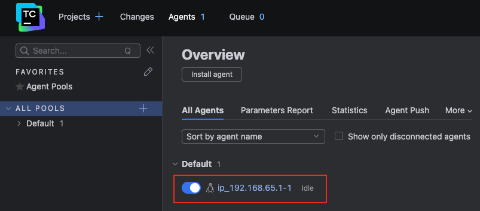
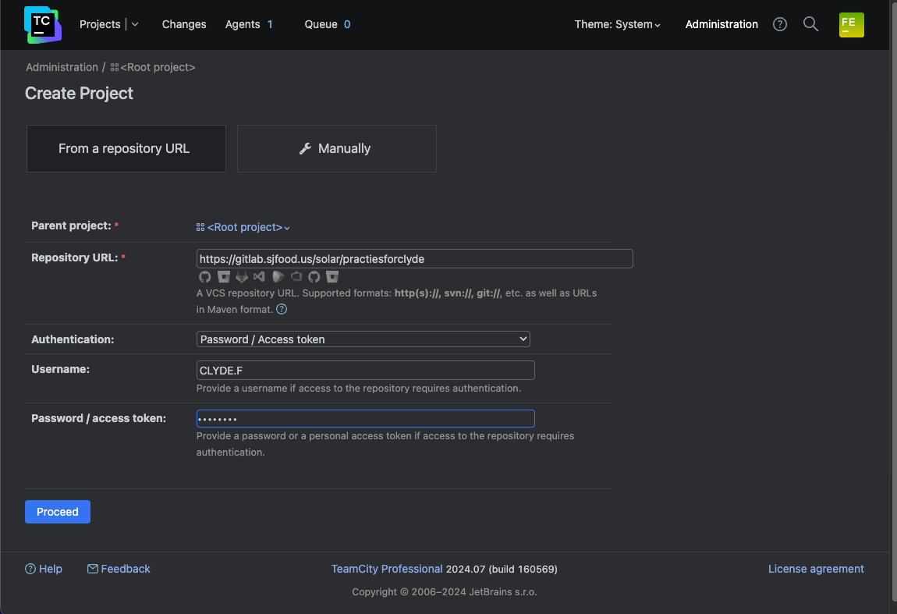
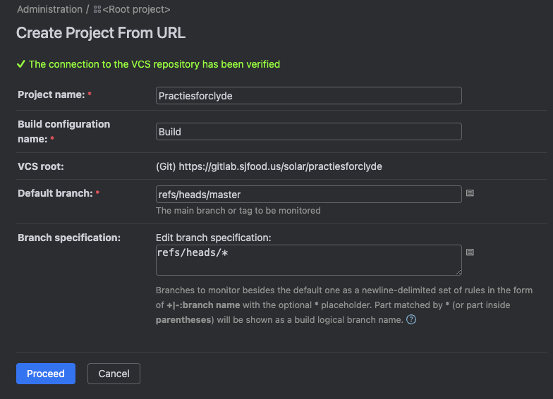
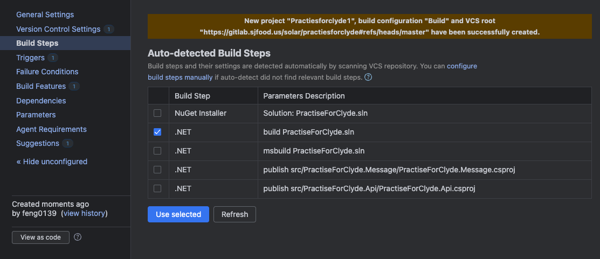
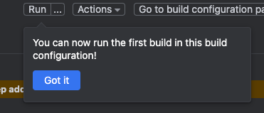
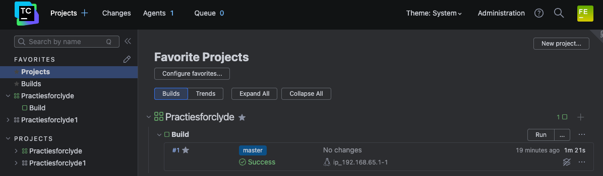

# 学习内容
## TeamCity
学习CI流程，首先从Docker安装流程开始。

DockerHub 上有 Jetbrains 官方的 TeamCity 镜像，直接通过 Docker 桌面端 Pull 镜像然后 Run 设置映射端口(默认8111)，随后确定运行，启动成功。访问 localhost:8111 进行初始化即可。若想编译项目需要使用Agent，所以接下来安装Agent。

### 安装程序
#### 第一步：拉取 Agent 镜像
Pull Jetbrains官方 TeamCity-Agent 镜像，其中自带一些运行环境如 .Net SDK 6.0.x，但是后续测试项目使用的是 8.0的SDK，需要额外安装环境。
```
docker pull jetbrains/teamcity-agent
```

#### 第二步：自定义镜像
由于默认的Agent镜像运行后无法切换到root账号，所以手动创建一个基于Agent的镜像，切换到root，同时提前安装一些工具软件。

新建文件夹，创建 DockerFile文件，内容如下：
``` dockerfile
# 基于官方TeamCity代理镜像
FROM jetbrains/teamcity-agent

# 切换到root用户以进行安装
USER root

# 设置root用户密码
RUN echo "root:root" | chpasswd

# 更新包列表并安装sudo和vim
RUN apt-get update && apt-get install -y sudo vim
```

#### 第三步：编译镜像文件
CD到含DockerFile文件夹，执行编译镜像命令
```
docker build -t custom-teamcity-agent-test .
```

#### 第四步：运行自定义镜像容器
使用自定义镜像创建容器
```
docker run -d -e SERVER_URL="<此处填写TeamCity地址>:<端口号>" --name="teamcity-agent-test" custom-teamcity-agent-test
```

`-e SERVER_URL` 参数是必须要指定TeamCity地址的，否则容器无法运行。

#### 第五步：安装额外环境
进入容器终端，安装 .NET SDK，配置环境
``` 
docker exec -it <容器ID> /bin/bash

# 进入终端后，分别执行安装 SDK 8.0 9.0
curl -sSL https://dotnet.microsoft.com/download/dotnet/scripts/v1/dotnet-install.sh | bash /dev/stdin --channel 8.0 --install-dir /usr/share/dotnet

curl -sSL https://dotnet.microsoft.com/download/dotnet/scripts/v1/dotnet-install.sh | bash /dev/stdin --channel 9.0 --install-dir /usr/share/dotnet
```

#### 第六步：重启容器
重新启动Agent容器，TeamCity正常识别 .Net SDK 8.0 和 9.0

#### 第七步：允许Agent使用
回到 TeamCity 网页中，点击 顶部菜单的 Agents，此处应该会显示前面部署运行的Agent，我们需要将其启用，目前是作为公共Agent的，所有项目编译都可以使用这个，只要其运行环境允许。




### 使用方法
浏览器访问 localhost:8111 进行初始化后，如下图：


左上角 Projects + 点击添加项目，如下图：



确认后，设置基本配置，目前默认即可，如下图：



确认后，将跳转到项目编译步骤，这里会扫描项目内容，选择其中需要编译的项，如下图：



点击 Use Selected 后，如果Agent已经配置成功则会在右上角弹窗提示Run，如下图：



点击Run后，可以在首页中查看执行结果，如下图：

