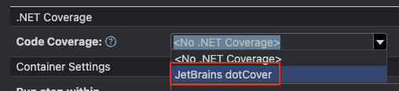

# 学习内容
昨天在 `TeamCity` 中添加了 `PractiesForClyde` 项目，进行了首次 `Run` 也成功编译（不含单元集成测试）。今天将这一块补齐，由于 `PractiesForClyde` 项目集成测试涉及到数据库环境，所以需要对 `Agent` 增加运行环境。

## 添加数据库环境
### 安装
项目需要数据库环境为 `Mysql 8.0` 及以上，那么首先进入 `Agent` 容器的终端，先安装 `mysql-server`。
```shell
# 进入容器
docker exec -it <容器ID> /bin/bash
```

```shell
# 由于自定义镜像，默认切换为root账号，所以不需要提权操作
apt update
apt install mysql-server
apt install mysql-client
```

```shell
# 上述安装完成后，启动数据库
service mysql restart
```

### 配置
输入命令，配置数据库环境，设置一下密码的校验，移除匿名访问，允许 `root` 远程访问。
```shell
# 此命令为配置Mysql，回车后可能会要求你输入当前系统账号密码，我设置的密码是123456
mysql_secure_installation

# 后续配置项，提示输入语句如下：
Press y|Y for Yes, any other key for No: <此处是你的输入>
```

以下是配置流程
```shell
# 是否启用校验密码组件
Would you like to setup VALIDATE PASSWORD component?
Press y|Y for Yes, any other key for No: <此处输入 y 启用>
```

```shell
# 随后提示选择其中一个校验级别，分别为：LOW、MEDIUM、STRONG
There are three levels of password validation policy:
Please enter 0 = Low，1 = MEDIUM，2 = STRONG: <此处输入 0 回车最低级别>
```

```shell
# 可能会出现设置数据库 root 密码步骤，只是编译环境，设置个简单密码就行
New Password: <输入 123456 密码>
Re-enter new password: <重复输入>
```

```shell
# 是否移除匿名访问
Remove anonymous users? 
(Press y|Y for Yes, any other key for No): <此处输入 y 回车移除>
```

```shell
# 是否禁用 root 的远程登录
Disallow root login remotely？
(Press y|Y for Yes, any other key for No): <此处输入 n 回车取消禁用>
```

```shell
# 删除 test 数据库
Remote test database and access to it?
(Press y|Y for Yes, any other key for No): <此处输入 y 回车删除>
```

```shell
# 是否重新加载配置
Reload privilege tables now?
(Press y|Y for Yes, any other key for No): <此处输入 y 回车重新加载>
```

配置完毕。连接数据库，二次配置。
```shell
# 连接
mysql -u root -p

# 选择mysql数据库
use mysql;

# 修改密码复杂度
set global validate_password.policy=0;
set global validate_password.length=1;

# 如果想修改root密码，可以输入这个语句
alter user 'root'@'localhost' identified with mysql_native_password by '123456';

# 退出数据库
exit;
```

重新启动数据库，加载改动。
```shell
# 上述配置完成后，重新启动数据库
service mysql restart
```

## 运行CI流程
1. 打开 `TeamCity` 的 `PractiesForClyde` 项目的编辑配置，新增一个 `Build Steps`。


2. 选择 `.NET`


3. 填写基本信息
	1. `Command` 选择为 `test`
	2. `Projects` 点击最右则的按钮，选择项目集


4. 配置 `Coverage`
	1. `Code Coverage` 配置为 `JetBrains dotCover`
	2. `dotCover CLT home directory` 配置为 `<Default xxx>`


