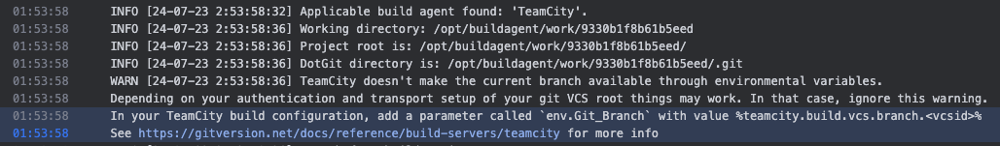

# 学习内容
使TeamCity的项目生成版本号，Agent需要增加dotnet-gitversion环境。

```shell
# 进入容器
docker exec -it <容器ID> /bin/bash
```

```shell
# 执行安装
dotnet tool install --global GitVersion.Tool
```

重新启动 `Agent`，尝试 `Run` 有无问题，会发现失败，经过查询Log发现如下提示：

```
TeamCity doesn't make the current branch available through environmental variables.

Depending on your authentication and transport setup of your git VCS root things may work. In that case, ignore this warning.

In your TeamCity build configuration, add a parameter called `env.Git_Branch` with value %teamcity.build.vcs.branch.<vcsid>%

See https://gitversion.net/docs/reference/build-servers/teamcity for more info
```



解决流程如下，打开项目配置页面，编辑 `Build Configurations`。


切换到 `Parameters` 页面，新增 `Parameters`。


配置如下，前两项固定，`Value` 需要选择 `teamcity.build.vcs.branch.xxxxxxxx`。

详情可以查看 [GieVersion在TeamCity配置](https://gitversion.net/docs/reference/build-servers/teamcity)


再次 `Run`，成功通过，并且成功携带版本号。

