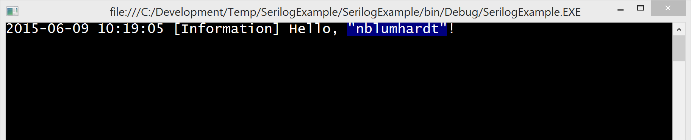
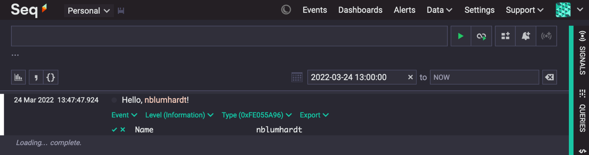

# Serilog
Serilog 是一个可以替代 Microsoft.Extensions.Logging 的日志记录器。

## 特性
1. 将日志以结构化形式（如Json）记录，易于查询。
2. 多种日志输出途径如：Console、File、Seq等等。
3. 提供了丰富的配置项。
4. 支持不同的条件过滤日志记录，级别，来源等等。
5. 有许多的库专门对 Serilog 提供了支持。

## 安装
可以通过 nuget UI 或通过 nuget 包管理器控制台安装：
```PowerShell
PM> Install-Package Serilog
```

## 配置方式
1. 使用代码配置
```csharp
using Serilog;

Log.Logger = new LoggerConfiguration()
    .Enrich.FromLogContext()                           // 从日志上下文中获取信息
    .Enrich.WithProperty("Application", "MyApp")      // 添加自定义属性
    .WriteTo.Console()                                // 输出到 控制台
    .WriteTo.File("logs/log.txt")                     // 输出到 文件
    .CreateLogger();
```

2. 使用配置文件
```json
// appsettings.json
{
  "Serilog": {
    "Using": [ "Serilog.Sinks.Console", "Serilog.Sinks.File" ],
    "MinimumLevel": {
      "Default": "Information"
    },
    "WriteTo": [
      { "Name": "Console" },
      { "Name": "File", "Args": { "path": "logs/log.txt" } }
    ]
  }
}
```

```csharp
using Microsoft.Extensions.Configuration;
using Serilog;

var configuration = new ConfigurationBuilder()
    .AddJsonFile("appsettings.json")
    .Build();

Log.Logger = new LoggerConfiguration()
    .ReadFrom.Configuration(configuration)
    .CreateLogger();
```

## 记录日志方法
1. 简单记录
```csharp
Log.Debug("message");  
Log.Information("message");  
Log.Warning("message");  
Log.Error("message");  
Log.Fatal("message");
```

2. 异常记录
```csharp
try
{
    // logic...
}
catch (Exception ex)
{
    Log.Error(ex, "An error occurred");
}
```

3. 添加自定义属性记录
```csharp
using (LogContext.PushProperty("UserId", userId))
{
    Log.Information("User action performed.");
}
```

## 集成到Autofac
获取 `ContainerBuilder` 对象，注册 `Log.Logger`.
```csharp
void RegisterLogger(ContainerBuilder builder)  
{
	builder.RegisterInstance(Log.Logger)
		.AsSelf()
		.AsImplementedInterfaces()
		.SingleInstance();  
}
```


# Seq
Seq 是一个现代的日志管理平台，用于集中式存储、查询和分析结构化日志数据。与Serilog日志库兼容，能够接收、存储和查询日志数据。

## 安装
### Server
通过Docker安装，开箱即用。执行命令：
```shell
docker run --name seq -d --restart unless-stopped -e ACCEPT_EULA=Y -p 5341:80 datalust/seq:latest
```

### NuGet 包
可以通过 nuget UI 或通过 nuget 包管理器控制台安装：
```PowerShell
PM> Install-Package Serilog.Sinks.Seq
```

## 代码配置
```csharp
using Serilog;

Log.Logger = new LoggerConfiguration()
	.WriteTo.Seq("http://localhost:5341") // 指定seq服务地址
	.CreateLogger();
```

## 示例
```csharp
Log.Information("Hello, {Name}!", Environment.UserName);
```



